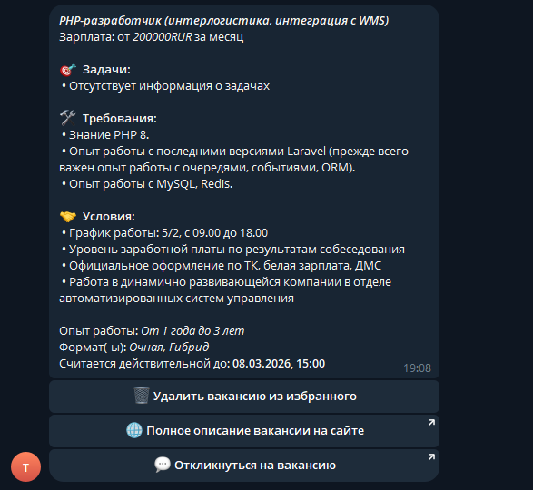
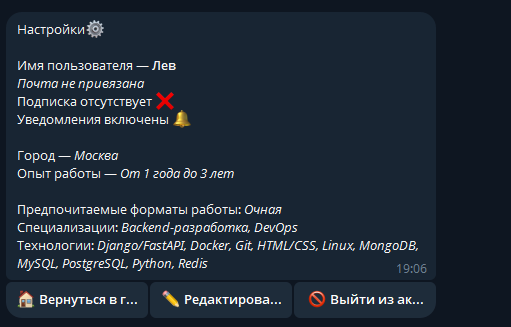
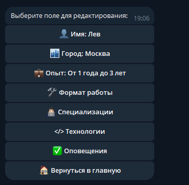
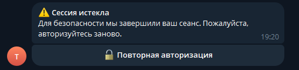

# 🚀 Techhire — Экосистема поиска и подбора IT-вакансий

**Techhire** — это современная многокомпонентная платформа, разработанная для автоматизации процесса поиска работы и управления профессиональным профилем в IT-индустрии. Проект объединяет мощь веб-сервиса и гибкость асинхронного Telegram-бота для максимально удобного взаимодействия с рынком труда.

## 🌟 О проекте
Проект решает проблему разрыва между классическими веб-платформами и мобильностью пользователей. Techhire позволяет не только просматривать актуальные предложения, но и гибко настраивать свой профессиональный стек «на лету», получая персонализированную выдачу рекомендованных вакансий прямо в профиле мессенджера.

## 🚀 Ключевые возможности (Features)

Проект Techhire реализует полный цикл взаимодействия пользователя с рынком вакансий, используя продвинутые механизмы асинхронной обработки данных и кэширования.

### ⚙️ Backend, API
* **Поиск вакансий:** Реализован поиск вакансий на основе запроса пользователя и предпочитаемого уровня дохода (в рублях) с использованием API крупнейших агрегаторов — *HeadHunter* и *Superjob*.
* **Персональные рекомендации:** Система подбора наиболее релевантных вакансий на основе личного портфолио навыков, опыта и предпочтений (формат работы, локация). При формировании рекомендаций учитывается активность пользователя в сервисе: история поиска и добавления в избранное. Резерв вакансий (~2500 на один крупный город) обеспечивает уникальность выдачи.
* **Избранное:** Возможность сохранять понравившиеся вакансии в персональный список для быстрого доступа с поддержкой мгновенного удаления.
* **Персонализация профиля:** Гибкое редактирование профиля пользователя, включая возможность добавления собственных технологий, если подходящего варианта не оказалось в справочнике.
* **Безопасная Stateless-авторизация (Token-based):** Защищенная система доступа к API на основе токенов позволяет полностью отделить логику хранения сессий от сервера и обеспечивает безопасное взаимодействие между распределенными компонентами (бэкенд, бот, внешние сервисы).

### 🔑 Двухэтапная регистрация и Onboarding

Для обеспечения наилучшего пользовательского опыта реализован интуитивно понятный процесс регистрации, разделенный на два этапа:

1. **Telegram регистрация/аутентификация:** Мгновенная привязка учетной записи мессенджера к платформе Techhire для идентификации пользователя и безопасная передача токена доступа.
2. **Персонализация профиля:**
   * **Выбор специализаций и технологий:** Настройка направлений (например, DevOps) и конкретных навыков (например, Python, Docker) через Many-to-Many связи.
   * **Опыт и предпочтения:** Указание стажа работы, желаемого формата (удаленка/офис) и города проживания.
   * **Завершение:** После настройки профиля система активирует автоматический подбор вакансий.

### 🤖 Интеллектуальный Telegram-бот
* **Интерактивное управление профилем:** Полноценное редактирование данных пользователя, включая сложные поля со связями Many-to-Many, прямо в интерфейсе мессенджера.
* **Умный поиск технологий:** Система «живого поиска» по базе данных, содержащей более 50+ наименований навыков.
* **Оптимизированный UX вакансий:**
    * Интеллектуальная обрезка длинных описаний для сохранения читабельности сообщения.
    * Визуальное структурирование блоков (Задачи, Требования, Условия) с помощью тематических эмодзи.
    * Динамические Inline-кнопки для управления вакансиями (отклик, избранное, просмотр на сайте).
* **Безопасность:** Возможность выхода из учетной записи или повторного входа в сервис прямо внутри бота.

### 📑 Структурирование неразмеченного контента
Techhire решает проблему «грязных» данных, с которой сталкивается большинство агрегаторов:
* **Сегментация текста:** В то время как другие сервисы хранят тело вакансии как единый кусок HTML, проект интеллектуально выделяет отдельные блоки: **Задачи**, **Требования** и **Условия**.
* **Улучшенный UX:** Выделенные блоки форматируются и снабжаются иконками, что позволяет мгновенно считывать ключевую информацию.
* **Автоматическая адаптация:** При выводе в Telegram длинные блоки данных проходят через алгоритм обрезки, сохраняя фокус на самом важном.

### 📡 API Endpoints & Actions

Бот и фронтенд взаимодействуют с бэкендом через RESTful API. Ключевые эндпоинты системы:

| Метод(-ы) | Эндпоинт | Описание |
| :--- | :--- | :--- |
| `POST` | `/api/accounts/telegram-auth` | Привязка Telegram-аккаунта и создание базовой записи. |
| `POST` | `/api/accounts` | Дозаполнение данных профиля (стек, опыт, локация). |
| `POST` | `/api/accounts/logout` | Выход из учетной записи. |
| `GET`/`PATCH` | `/api/accounts/me` | Взаимодействие с текущим профилем пользователя. |
| `POST` | `/api/accounts/add-technology` | Добавление нового варианта технологии в базу. |
| `GET` | `/api/vacancies/recommendations` | Получение списка рекомендованных вакансий. |
| `GET` | `/api/vacancies/search` | Поиск вакансий по фильтрам и уровню зарплаты. |
| `GET` | `/api/vacancies/favourites` | Получение списка избранных вакансий. |

> **Примечание:** Все запросы, за исключением первичной авторизации, требуют передачи токена в заголовке `Authorization: Token <key>`.

### 🧪 Тестирование и качество кода
Проект покрыт unit и интеграционными тестами для проверки стабильности ключевых узлов системы:
* **Backend**: Тестирование API-эндпоинтов (DRF APITestCase) и валидация логики обработки данных.
* **Logic**: Проверка корректности работы алгоритмов сегментации текста и фильтрации вакансий.
* **Инструменты**: `Django Test Framework` / `DRF APITestCase`.

### 🛠 Стек технологий
* **Backend Core:** `Django 5.x` + `Django REST Framework` (архитектура API-first).
* **Bot Frontend:** `Aiogram 3.x` — асинхронный фреймворк для взаимодействия с пользователем.
* **Database:** `PostgreSQL` — надежное хранение данных и сложных связей.
* **Integration:** `Aiohttp` — асинхронные запросы между ботом и API.
* **Task Queue:** `Celery` — фоновая обработка задач (архивация вакансий, рассылки).
* **Scheduling:** `Celery Beat` — планировщик задач (сбор и анализ новых вакансий).
* **Cache/Broker:** `Redis` — кэширование данных и брокер сообщений для Celery.

### 📸 Интерфейс бота

  
  
  
  

